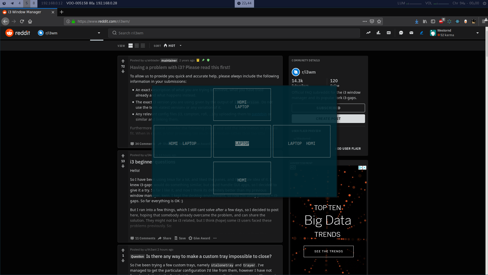

# Xrandr-ncurses
Manage easily your screens with i3

## dependency
* ncurses

## What does it do ?
* Choose the screens that you want to use
* Reload polybar
* Reload nitrogen

## Installation
* (opt) build it
* Just copy (or `ln`) `hdmi.sh` in `~/.local/bin`
* Add in your I3 config `bindsym $mod+j exec --no-startup-id hdmi`

## Customise
You can add for each state the bash command that you want to Add

Enjoy !
